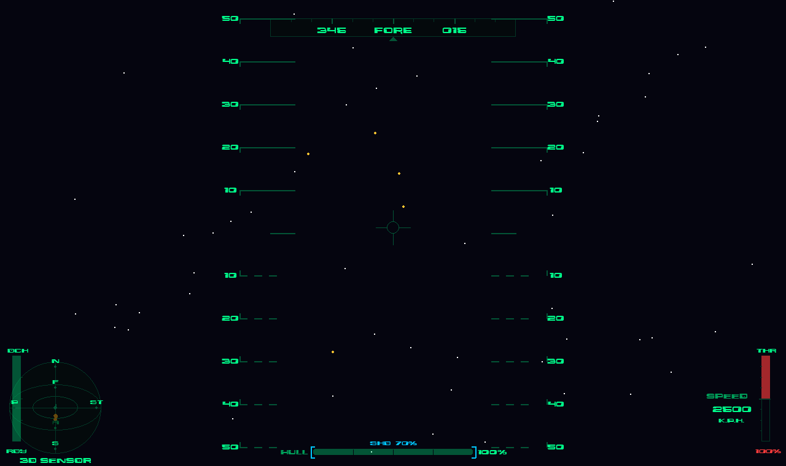
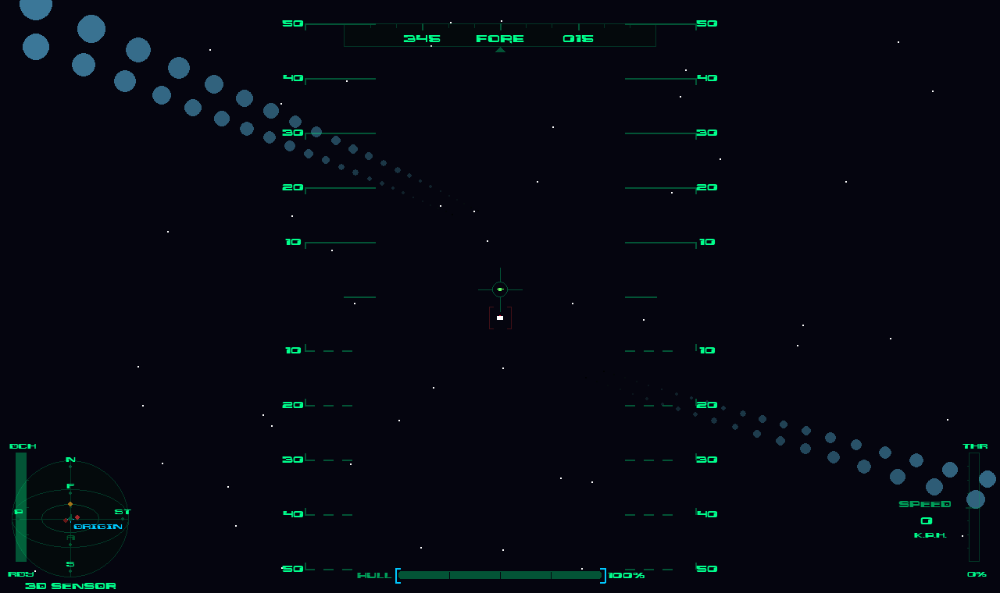

# 3D SPACE — Cockpit Dogfighter



A first-person 3D space dogfighter written in pure Python. No GPU. No engine.
No stacks of CUDA cores. Just quaternions, `pygame-ce`, and a stubborn belief
that software rendering can still slap.

> *"You don't need ray-traced lighting and photorealism. If it's fun and sharp
> and 60fps, that's what you want."*

## What is this

You are a pilot in a cockpit, in deep space, and things are trying to kill you.
Fly with a real 6-DOF quaternion flight model (pitch, yaw, and roll are always
relative to *your* cockpit, never the world), manage throttle, shields, and a
dodge thruster, lock targets, and fight through scripted encounters — wedges,
pincers, sniper nests — backed by a wave director that keeps pressure on between
set-pieces.



## Features

- **Hand-rolled 3D** — custom quaternion math engine (`src/math_engine.py`);
  every vertex is CPU-projected every frame. Zero GPU required.
- **7 enemy types** — SuicideDrone, Dogfighter, Sniper (telegraphs with a
  charging beam before it fires — dodge or die), Corvette, Minelayer,
  StealthInterceptor, Carrier.
- **Scripted encounters + procedural filler** — `src/encounters.py` defines
  set-pieces (wedge, pincer, sniper nest…); the `WaveDirector` fills the gaps.
- **Cockpit HUD** — pitch ladder, heading tape, 3D sensor sphere, hull/shield
  bars, throttle/speed gauges, target lock indicator, dodge and shield meters,
  damage overlay.
- **Dodge system** — hold Circle + a stick direction to kick the thrusters
  sideways. Shields regenerate if you stop getting hit.
- **Performance engineering** — object pools for lasers and particles, spatial
  partitioning for collision queries. It stays at 60fps on modest hardware.
- **Mesh tools** — `tools/` has 2D/3D viewers with vertex *and* face editing;
  every enemy mesh in the game was authored in them.

## Controls

### Keyboard

| Key | Action |
|---|---|
| `W` / `S` | Pitch |
| `A` / `D` | Roll |
| `←` / `→` | Yaw |
| `↑` / `↓` | Throttle up / down |
| `Space` | Fire |
| `T` | Target closest enemy |
| `Y` | Cycle target |
| `Esc` | Quit |

### Controller (DS4 layout)

| Input | Action |
|---|---|
| Left stick | Pitch / roll |
| Right stick X | Yaw |
| `L2` / `R2` | Fire |
| `L1` / `R1` | Throttle down / up |
| `R3` (click) | Zero throttle |
| `Circle` + stick | Dodge thrust |
| D-pad up | Cycle target |

### TwinStick phone controller

The game also speaks the Xbox-style `xpad` layout, which is what the
[TwinStick Controller](https://github.com/Pazuzu1wish/twinstick-controller)
phone app emits. Pair the phone, then run:

```bash
python main.py --layout xpad
```

`--layout` also accepts `ds4` (default) and `auto`, which guesses from the
device name. If your host enumerates the TwinStick's buttons/axes differently,
remap them in the TwinStick app's Profiles screen — no game changes needed.

## Run it

```bash
pip install -r requirements.txt
python main.py
```

Needs Python 3 and `pygame-ce`. That's it. No build step, no assets to download.

## Project structure

```
main.py                  # entry point: Game().main()
src/
  math_engine.py         # quaternion camera + projection (the heart of it)
  game.py                # main loop, update/draw
  player.py              # 6-DOF flight model, weapons, dodge, shields
  enemy.py               # 7 enemy types + AI
  director.py            # wave director (scripted + procedural spawning)
  encounters.py          # scripted encounter definitions
  cockpit.py             # HUD rendering
  controller.py          # DS4 input abstraction + debug visualizer
  spatial_partition.py   # grid-based collision queries
  object_pool.py         # pooled lasers + particles
  laser.py / projectile.py / particle.py / star.py / utils.py
  constants.py           # tuning knobs live here
tools/
  3d_viewer.py           # mesh viewer + vertex/face editor
  2d_viewer.py           # 2D mesh viewer
extra_docs/              # dev notes: collision fixes, optimizations, integration
```

## Roadmap

- Title / game-over / victory flow (right now you fly until you die)
- Sound — procedural SFX, no assets needed
- More encounter scripts and a second act
- TwinStick phone-controller profile (pairs with the
  [TwinStick Controller](https://github.com/Pazuzu1wish/twinstick-controller) app)

## License

MIT — see [LICENSE](LICENSE).
